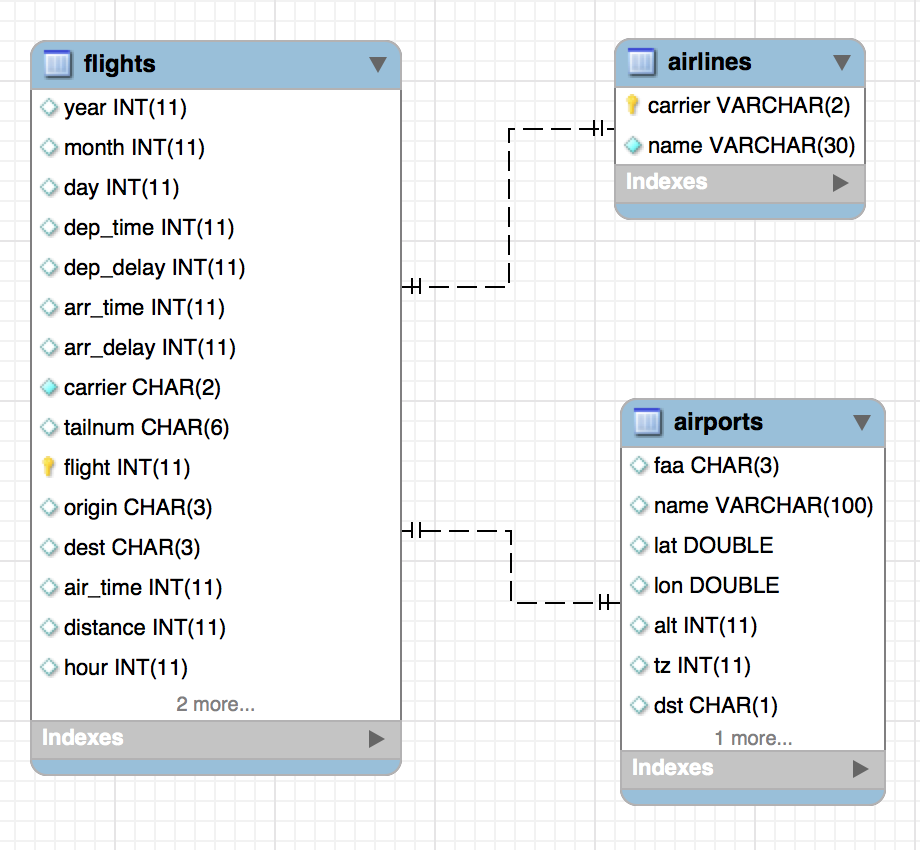
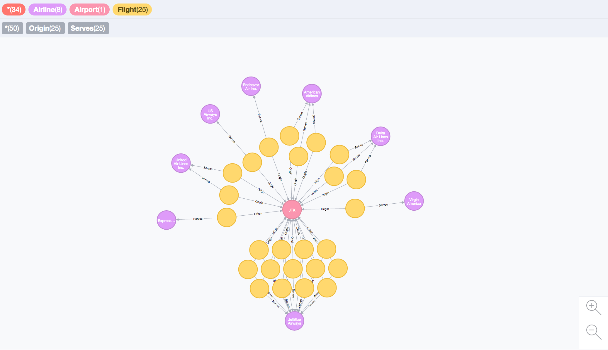

```{r setup, include=FALSE}
knitr::opts_chunk$set(echo = TRUE)
```

# Abstract

For Project 4, we are asked to take information from a relational database and migrate it to a NoSQL database of your own choosing.   For this project, we will use MySQL for our relational database, and Neo4j for our NoSQL database. 

We will use the flights database, which is based on used in Hadley Wickham's 'nycflights13' package.    Since this assignment focuses on exporting from NoSQL, we have provided a flightsdb.sql script that will create a database with 5 tables.  

We will focus on the following tables, likely to have a relationship infrastructure that could be improved by storing in a graph database:

* airlines
* airports
* flights

## EER



# Environment Prep

```{r, warning=FALSE, message=FALSE}
source("P4creds.R")
if (!require("RMySQL")) install.packages('RMySQL')
if (!require('RNeo4j')) install.packages('RNeo4j')
```

## P4creds.R

Source file contains the following vars that should be set by user to connect to their MySQL and Neo4j installations.  

* sqluser
* sqlhost
* neouser
* neopass

# MySQL:  Pull data into R

## Connect and Query: Flights DB

```{r}
mydb <- dbConnect(MySQL(), user=sqluser, dbname='flights', host=sqlhost)

airlines <- dbGetQuery(conn = mydb, statement = 
                          "SELECT * FROM airlines")
airports <- dbGetQuery(conn = mydb, statement = 
                          "SELECT * FROM airports")
flights <- dbGetQuery(conn = mydb, statement = 
                          "SELECT * FROM flights")

dbDisconnect(mydb)
```

## Clean and Subset

Handling all flights is proved too computationally expensive to easily play in the Neo4j browser for this exercise.   Instead, let's just look at flights on February 1, 2013 flights from 400-700 (~100 flights).   We'll subset each of our tables accordingly.

```{r}
#subset ~ 100 flights
flights <- flights[flights$month == 2,]
flights <- flights[flights$day == 1,]
flights <- flights[flights$dep_time > 400 & flights$dep_time < 700, ]

## let's only grab the airports in our new flights df
airports <- airports[airports$faa %in% flights$dest | airports$faa %in% flights$origin, ]

# same for airlines
airlines <- airlines[airlines$carrier %in% flights$carrier,]
```

# Neo4j:  Push data from R

## Init

```{r}
graph = startGraph("http://localhost:7474/db/data/", username=neouser, password=neopass)
clear(graph, input = FALSE)
```

## Node: Airlines

```{r}
addConstraint(graph, "Airline", "carrier")

query1 <- "
CREATE (a:Airline {carrier: {carrier}, name: {name}})
"

t = newTransaction(graph)

for (i in 1:nrow(airlines)) {
  carrier = airlines$carrier[i]
  name = airlines$name[i]

  appendCypher(t, 
               query1, 
               carrier = carrier, 
               name = name)
}

commit(t)
```

## Node: Airports

```{r}
query2 <- "
CREATE (b:Airport {faa: {faa}, name: {name}})
"

t = newTransaction(graph)

for (i in 1:nrow(airports)) {
  faa = airports$faa[i]
  name = airports$name[i]

  appendCypher(t, 
               query2, 
               faa = faa, 
               name = name)
}

commit(t)
```

## Node: Flights

```{r}
query3 <- '
CREATE (c:Flight {name: {name}, carrier: {carrier}, 
origin: {origin}, dest: {dest}})
'

t = newTransaction(graph)

for (i in 1:nrow(flights)) {
  name = flights$flight[i]
  carrier = flights$carrier[i]
  origin = flights$origin[i]
  dest = flights$dest[i]

  appendCypher(t, 
               query3, 
               name = name, 
               carrier = carrier,
               origin = origin,
               dest = dest)
}

commit(t)


```

## Edge: Flight / Carrier

```{r}
query4 <- '
MATCH (a:Flight) WHERE a.carrier={carrier} AND a.name={fnum}
MATCH (b:Airline) WHERE b.carrier={carrier}
CREATE (a) -[r:Serves] -> (b)
'

t = newTransaction(graph)

for (i in 1:nrow(flights)) {
  carrier = flights$carrier[i]
  fnum = flights$flight[i]

  appendCypher(t, 
               query4, 
               fnum = fnum,
               carrier = carrier)
}
commit(t)
```

## Edge: Destination

```{r}
query5 <- '
MATCH (a:Flight) WHERE a.dest={dest} AND a.name={fnum}
MATCH (b:Airport) WHERE b.faa={dest}
CREATE (a) -[r:Destination {arr_time:{arr_time}}] -> (b)
'

t = newTransaction(graph)

for (i in 1:nrow(flights)) {
  dest = flights$dest[i]
  fnum = flights$flight[i]
  arr_time = flights$arr_time[i]

  appendCypher(t, 
               query5, 
               fnum = fnum,
               dest = dest, 
               arr_time = arr_time)
}
commit(t)
```

## Edge: Origin

```{r}
query6 <- '
MATCH (a:Flight) WHERE a.origin={origin} AND a.name={fnum}
MATCH (b:Airport) WHERE b.faa={origin}
CREATE (a) -[r:Origin {dep_time:{dep_time}}] -> (b)
'

t = newTransaction(graph)

for (i in 1:nrow(flights)) {
  origin = flights$origin[i]
  fnum = flights$flight[i]
  dep_time = flights$dep_time[i]
  
  appendCypher(t, 
               query6, 
               origin = origin,
               fnum = fnum, 
               dep_time = dep_time)
}
commit(t)
```

# Visualization

CYPHER QUERY: __MATCH (n)-[r]->(m) RETURN n, r, m__


CYPHER QUERY: __MATCH p = (:Airline)<--(:Flight)-[*]->(:Airport {faa: 'JFK'}) RETURN p__



# Advantages / Disadvantages of Different Storage Methods

For data with relationships, graph databases like Neo4j have a clear advantage if the primarily desire of the study is to better understand the way data features relate.   It should also be relatively simple to add data in real time using this method, making it an ideal choice for streaming data.  

For structured and more static data, traditional relational databases like MySQL have a major advantage - they have been around for longer and have a wide range of powerful tools to accomplish both basic and advanced tasks. 

# References 

* [http://stackoverflow.com/questions/25295590/how-to-create-nodes-in-rneo4j-using-vectors-or-dataframes](http://stackoverflow.com/questions/25295590/how-to-create-nodes-in-rneo4j-using-vectors-or-dataframes)
* [Nicole White, author of RNeo4J Package](nicolewhite.github.io/)

