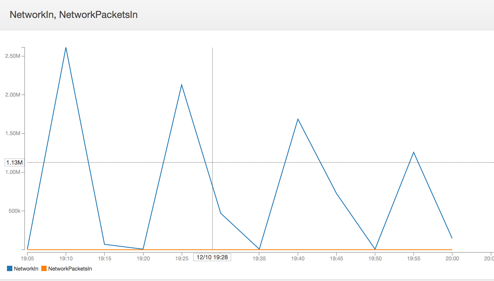
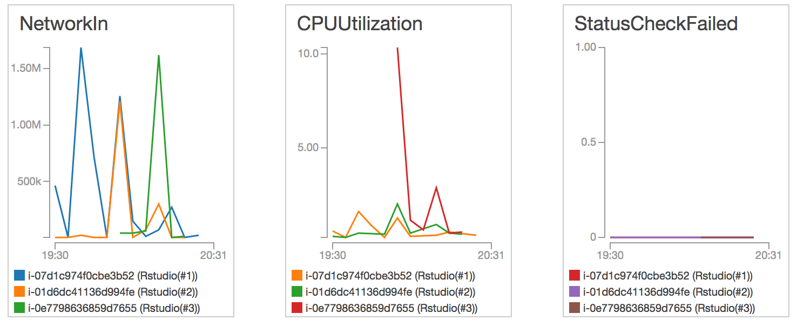

```{r setup, include=FALSE}
knitr::opts_chunk$set(echo = TRUE)
```

# Abstract

The CUNY DATA 607 final project is an opportunity to learn more about working with Twitter data, AWS, and MySQL, while learning to conduct a sentiment analysis.   

Because of the unique temporal nature of Twitter, we create a dataset culled from tweets of a popular live event with a curated hashtag:   The NBC airing of the live Hairspray musical on December 7th, 2016 (Dec 8, GMT) - #hairspraylive.  

We acquire the dataset after the live airing using the Twitter API.  Because of the nuances of the API and overall volume, our scrape will be split into days and use AWS EC2 to issue GET requests and a MySQL database for storage of results.   

Our dataset can then be explored to look at: 

* Sentiment as a TimeSeries- both during and around the event
* Volume and RT as TimeSeries

This scraped data could then be used in correlation with a positive/negative word lexicon to conduct a sentiment analysis. 

I expect to encounter challenges related to:

* How to weigh / measure RTs in a sentiment analysis
* How to predict or remove spam bot RTs.  
* If scraping multiple times, how to handle differences or duplicates in data.  
* Potential limitations in availability of scraped data. 
* Potential for misinterpreted hastags (eg - someone tweeting about #hairspray that is actually talking about their aquanet sprayed beehive)

# Environment Prep

```{r, warning=FALSE, message=FALSE}
if (!require("RMySQL")) install.packages('RMySQL')
if (!require('plyr')) install.packages ('plyr')
if (!require('stringr')) install.packages ('stringr')
```

# Data Acquisition

## AWS EC2

This is a popular event and grabbing all the data is time consuming.   While the final dataset isn't particularly large, it was challenging to manage the acquisition via the Twitter API.   

[This great walkthrough](http://strimas.com/r/rstudio-cloud-1/) helped a noob like me use RStudio in AWS EC2 and access both from CLI and in a browser.   [Louis Aslett](http://www.louisaslett.com/RStudio_AMI/) is kind enough to maintain an excellent Rstudio Amazon Machine Image (AMI) that also integrates with Dropbox, so it was reasonably trivial to save .csv files with generated/scraped data in Dropbox instead of an S3 bucket.  I spent some time configuring an instance of Rstudio, then saved as my own AMI so I could quickly and easily spin up additional instances with the same settings. 

I anticipate working this way often in the future.  

## Twitter API Credentials

In order to run the scrape function and get data, the user will need to create an application in the Twitter API and populate with the fields below.  Ours are stored in the file sourced below.  

* api_key
* api_secret
* access_token
* access_token_secret

## AWS_FP.R

Below find an example of what was used in EC2 to scrape Twitter.  This would be run on a VM to scrape for a single day, then saved to a csv which we will later import into MySQL.   

```{r, eval=FALSE}
if (!require('twitteR')) install.packages ('twitteR')
if (!require('ROAuth')) install.packages ('ROAuth')
if (!require('httr')) install.packages ('httr')

source('FPCredentials.R')

options(httr_oauth_cache=TRUE)
setup_twitter_oauth(api_key, api_secret, access_token, access_token_secret)

#version to just look for date range
data1 <- searchTwitter("#hairspraylive", n=100000, since='2016-12-07', until='2016-12-08', lang="en")

#setdf (meth1)
df1 <- twListToDF(data1)

#write to csv for later use
write.csv(df1, file="df1.csv")

rm(access_token, access_token_secret, api_key, api_secret)

## Check Session Limits
rate.limit <- getCurRateLimitInfo()
# print out all metrics that have been changed
rate.limit[rate.limit$limit != rate.limit$remaining,]
```

## Handling Rate Limit

Twitter chokes API calls from a single IP address.   Below, you can see the periodic call restrictions imposed, followed by a lower ceiling for the next call. 



To solve this problem, I attempted to run these calls in parallel from 3 separate instances, each instance responsible for gathering data from a single day.  

SIDE NOTE:  Twitter has many disclaimers about their API - ultimately it is not a good resource for 'reproduceability'.  To test this, I ran the same query of data from 48hrs prior on two separate instances at the same time.   The resulting datasets were similar, but where one had 37.4k observations, the other had 39.2k.   Again, not ideal for reproduceability, but good enough for an informal sentiment analysis.

I used AWS Cloudwatch to set alerts and configure a small dashboard where I could monitor progress/performance.  Having monitoring in place helped diagnose some of the issues related to pulling tweets the day of the event (since a much larger dataset).



## Handling Day Of

```{r, eval=FALSE}
#use popular result type to at least get a few (returns < 20, but in needed time frame)
d2 <- searchTwitter("#hairspraylive", since='2016-12-08', until='2016-12-09', lang="en", resultType="popular")

#combine with df that returned 100k, but missing 4 hrs.

```

# Data Management

## Storing in MySQL

A better data scientist would have found a more elegant workflow for managing this data, but for now, saving data culled from VMs as csvs in Dropbox, then loading into a local MySQL database will do.   If the volume were much greater, a more refined approach would be paramount.   

```{r, eval=FALSE}
mydb = dbConnect(MySQL(), user='root', dbname='hairsprayTwitter', host='localhost')

df1 <- read.csv('df1.csv')
df2 <- read.csv('df2.csv')
df3 <- read.csv('df3.csv')
df4 <- read.csv('df4.csv')

# drop table rows if already there, but keep schema defined in MySQL.
dbGetQuery(mydb,"TRUNCATE TABLE tweets")

dbWriteTable(mydb, name='tweets', value=df1, append=TRUE)
dbWriteTable(mydb, name='tweets', value=df2, append=TRUE)
dbWriteTable(mydb, name='tweets', value=df3, append=TRUE)
dbWriteTable(mydb, name='tweets', value=df4, append=TRUE)

dbDisconnect(mydb)
```

## Pulling DF into R

```{r}
mydb = dbConnect(MySQL(), user='root', dbname='hairsprayTwitter', host='localhost')
query = dbSendQuery(mydb, 
                    "SELECT text, created, retweetCount, isRetweet, retweeted 
                    FROM hairsprayTwitter.tweets;")

#Review - maybe don't need retweeted, d1 and d3 are all FALSE

HS.df <- fetch(query, n=-1)
dbDisconnect(mydb)
```

## Start preparing the data

### Time Prep

To help standardize data acquired, the Twitter API assigns every observation a "created" variable that gives a timestamp in GMT.  For this project, we'll leave our data in GMT, but prepare some supplementary variables for use later. 

```{r}
#create date and time fields
HS.df$created <- strptime(HS.df$created, "%Y-%m-%d %H:%M:%S", tz = "GMT")
HS.df$date <- format(HS.df$created, "%Y-%m-%d")
HS.df$time <- format(HS.df$created, "%H:%M:%S")
HS.df$hour <- format(HS.df$created, "%H")
plot(table(HS.df$date, HS.df$hour))
```


# References 

* [Rstudio in EC2](http://strimas.com/r/rstudio-cloud-1/)
* [Rstudio AMI](http://www.louisaslett.com/RStudio_AMI/)
* [https://www.r-bloggers.com/how-to-use-r-to-scrape-tweets-super-tuesday-2016/](https://www.r-bloggers.com/how-to-use-r-to-scrape-tweets-super-tuesday-2016/)

