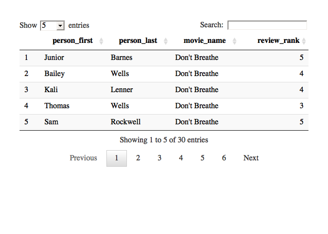
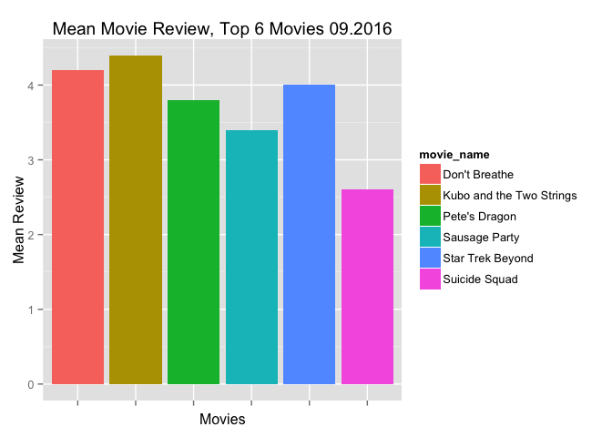

DATA 607: R and MySQL, Week2HW
================
Walt Wells, Fall 2016

### Make Connections

``` r
if (!require("DT")) install.packages('DT')
if (!require("RMySQL")) install.packages('RMySQL')
if (!require("ggplot2")) install.packages('ggplot2')
mydb = dbConnect(MySQL(), user='root', dbname='movies', host='localhost')
dbListTables(mydb)
```

    ## [1] "movie_table"  "person_table" "reviews"

### Create DF from Connection Query

``` r
query = dbSendQuery(mydb, 
    "SELECT p.person_first, p.person_last, m.movie_name, r.review_rank 
    FROM movies.person_table p
        LEFT JOIN movies.reviews r
            ON p.person_id = r.person_id
        LEFT JOIN movies.movie_table m
            ON m.movie_id = r.movie_id
        ORDER BY m.movie_name;")
movie.df <- fetch(query)
dbDisconnect(mydb)
```

    ## Warning: Closing open result sets

    ## [1] TRUE

``` r
datatable(movie.df, options = list(pageLength = 5))
```



### Quick Viz

``` r
movie.df$movie_name <- as.factor(movie.df$movie_name)
ggplot(movie.df) + geom_bar(aes(movie_name, review_rank, fill=movie_name), stat="summary", fun.y="mean") + labs(x="Movies", y="Mean Review", title="Mean Movie Review, Top 6 Movies 09.2016") + theme(axis.text.x=element_blank())
```


